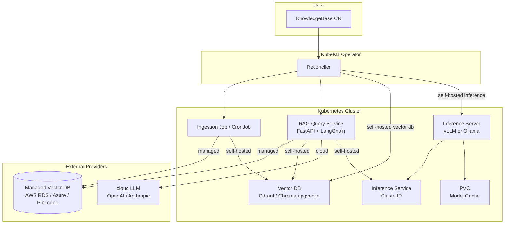

**KubeKB Architecture Documentation**

### Overview

**KubeKB** is a lightweight Kubernetes Operator that allows mobile/web developers to run a **private LLM/SLM + RAG knowledge base** using a single `KnowledgeBase` Custom Resource, pointing to a GitHub repository. Users can choose between **self-hosted** inference and vector DB (running inside the cluster) or **managed/cloud** providers (OpenAI, Anthropic, AWS RDS, Pinecone, etc.).

---

### 1. High-Level Architecture Diagram



---

### 2. Custom Resource Definition (CRD)

```yaml
apiVersion: kubekb.dev/v1alpha1
kind: KnowledgeBase
metadata:
  name: my-company-docs
spec:
  # --- Inference: pick a provider ---
  inference:
    provider: vllm                  # vllm | ollama | openai | anthropic
    model: "microsoft/Phi-3-mini-4k-instruct"
    cacheSize: 20Gi                 # self-hosted only
    # apiSecretRef:                 # cloud providers only
    #   name: openai-secret

  # --- Vector DB: pick a provider ---
  vectorDB:
    provider: qdrant                # qdrant | chroma | pgvector | aws-rds | azure-postgresql | pinecone
    storageSize: 10Gi               # self-hosted only
    # secretRef:                    # managed providers only
    #   name: vectordb-credentials
    # endpoint: ""                  # managed providers only (Pinecone, etc.)

  # --- Source ---
  githubRepo: "https://github.com/myorg/docs"
  githubBranch: "main"
  githubSecretRef:
    name: github-token-secret

  # --- RAG tuning ---
  rag:
    chunkSize: 1024
    chunkOverlap: 200
```

---

### 3. Component Breakdown

| Component              | Technology                          | Type                  | Key Features |
|------------------------|-------------------------------------|-----------------------|--------------|
| **Inference (self-hosted)** | vLLM or Ollama               | Deployment + PVC      | OpenAI-compatible API, model cache PVC |
| **Inference (cloud)**  | OpenAI / Anthropic           | External API call     | No cluster resources, API key via Secret |
| **RAG Query Service**  | Python FastAPI + LangChain          | Deployment (stateless)| Query endpoint, context retrieval, provider-agnostic LLM calls |
| **Vector DB (self-hosted)** | Qdrant / Chroma / pgvector   | Deployment + PVC      | In-cluster, no external dependency |
| **Vector DB (managed)**     | AWS RDS / Azure PostgreSQL / Pinecone | External Managed  | No StatefulSet, IRSA or secretRef auth |
| **Ingestion**          | Kubernetes Job + CronJob            | Ephemeral Job         | Git sync on CR change or commit change |
| **Model Cache**        | gp3 StorageClass PVC                | PersistentVolumeClaim | Survives pod crashes/restarts (self-hosted only) |

---

### 4. Data Flow

1. User applies `KnowledgeBase` CR with chosen `inference.provider` and `vectorDB.provider`.
2. Operator reconciles and conditionally creates:
   - **Self-hosted inference**: Inference `Deployment` + `PVC` + `Service`
   - **cloud inference**: Skipped — API key secret mounted into RAG pod
   - **Self-hosted vector DB**: Vector DB `Deployment` + `PVC`
   - **Managed vector DB**: Skipped — connection credentials mounted into RAG + Ingestion pods
   - RAG `Deployment`
   - `ServiceAccount` (for IRSA, if applicable)
3. Ingestion Job triggers:
   - Clones GitHub repo
   - Splits documents into chunks
   - Generates embeddings
   - Upserts into the configured vector DB
4. End-user applications call **RAG Service** → retrieves context from vector DB → sends augmented prompt to inference provider → returns response.

---

### 5. KnowledgeBaseStatus (Recommended)

```go
type KnowledgeBaseStatus struct {
    Phase              KnowledgeBasePhase    `json:"phase,omitempty"`
    Conditions         []metav1.Condition    `json:"conditions,omitempty"`
    
    ObservedGitCommit  string                `json:"observedGitCommit,omitempty"`
    LastIngestedAt     *metav1.Time          `json:"lastIngestedAt,omitempty"`
    
    InferenceEndpoint  string                `json:"inferenceEndpoint,omitempty"`
    RAGEndpoint        string                `json:"ragEndpoint,omitempty"`
    ModelLoaded        bool                  `json:"modelLoaded,omitempty"` // false for cloud providers
    
    Resources          KnowledgeBaseResources `json:"resources,omitempty"`
}

type KnowledgeBasePhase string
const (
    PhasePending   KnowledgeBasePhase = "Pending"
    PhaseIngesting KnowledgeBasePhase = "Ingesting"
    PhaseReady     KnowledgeBasePhase = "Ready"
    PhaseFailed    KnowledgeBasePhase = "Failed"
)
```

---

### 6. Provider Integration Highlights

**Self-hosted inference (vLLM / Ollama)**
- Operator creates a `Deployment` + `PVC` (gp3 StorageClass) + `ClusterIP` Service inside the cluster
- Model cache PVC survives pod restarts

**cloud inference (OpenAI / Anthropic)**
- Operator skips Deployment and PVC entirely
- API key secret is mounted as an env var into the RAG pod
- LangChain routes calls to the external API

**Self-hosted vector DB (Qdrant / Chroma / pgvector)**
- Operator creates a `Deployment` + `PVC` inside the cluster
- No external dependency required

**Managed vector DB (AWS RDS / Azure PostgreSQL / Pinecone)**
- Operator skips Deployment and PVC
- Connection credentials injected via `secretRef` or IRSA (AWS)
- RDS supports IAM Database Authentication (no static passwords)

---

### 7. Key Design Principles

- **Lightweight** — One YAML, two provider choices
- **Provider-agnostic** — Mix self-hosted and cloud freely (e.g. Ollama + Pinecone, or OpenAI + Qdrant)
- **Git-aware** — Automatic re-ingestion on commit changes
- **Resilient** — Model cache PVC survives pod restarts (self-hosted inference)
- **Secure** — IRSA for AWS, API key secrets for cloud, internal-only ClusterIP for self-hosted
- **Developer-friendly** — Clear status endpoints, phase tracking, and condition reporting

---

This architecture is production-ready, provider-agnostic, and scales from a fully self-hosted setup to a fully managed cloud configuration with a single field change.